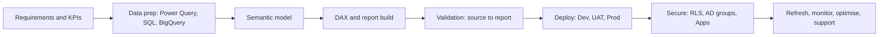

<!-- Portfolio README for recruiters. Ready to publish. -->

 

  

<a href="#snapshot">Snapshot</a> ·
<a href="#experience">Experience</a> ·
<a href="#case-studies">Case studies</a> ·
<a href="#skills">Skills</a> ·
<a href="#demos">Demo projects</a> ·
<a href="#credentials">Credentials</a>

---

## ⚡ Recruiter Snapshot

<table>
<tr>
<td align="center" width="25%"><h2>7+</h2>years in Power BI &amp; BI reporting</td>
<td align="center" width="25%"><h2>17+</h2>enterprise dashboards delivered at PwC, from hands-on builds to leading delivery</td>
<td align="center" width="25%"><h2>8</h2>Insurance functions supported Sales · HR · Billing &amp; Collections · DQ &amp; Governance · Inforce Book · IT Ticketing · Claims · RCU</td>
<td align="center" width="25%"><h2>40+</h2>projects unified in one issue-tracking dashboard</td>
</tr>
<tr>
<td align="center"><h2>4</h2>developers co-led across build, test and production</td>
<td align="center"><h2>15 min</h2>refresh requirement supported</td>
<td align="center"><h2>Dev → UAT → Prod</h2>release and access management</td>
<td align="center"><h2>PL-300</h2>Power BI Data Analyst Associate</td>
</tr>
</table>

| | |
|---|---|
| **Current role** | Senior Associate, **PwC India** (Jan 2026 – Present) |
| **Domains** | Insurance · Banking · Retail · Energy |
| **Core stack** | Power BI Desktop &amp; Service · DAX · Power Query · SQL · BigQuery · Semantic modelling · RLS |
| **What sets me apart** | I own the whole lifecycle: requirements, modelling, build, validation, deployment, security, refresh and production support |

## 🎯 What I Bring

<table>
<tr>
<td width="50%" valign="top">

**🧩 End-to-end ownership** 
Requirements with business stakeholders, KPI definition, semantic model, DAX, dashboards, testing, release and support. No hand-offs needed.

</td>
<td width="50%" valign="top">

**🔒 Numbers stakeholders can trust** 
Source-to-report reconciliation in SQL and BigQuery, controlled automated refresh, and centralised dashboards that replaced manually prepared reports and limited manual changes to reported figures.

</td>
</tr>
<tr>
<td valign="top">

**🏗️ Production-grade delivery** 
Dev, UAT and Prod workspaces, Apps, permissions, RLS through AD groups, refresh monitoring and automation via APIs, notebooks and data pipelines.

</td>
<td valign="top">

**🤝 Lead and communicator** 
Co-lead a team of 4 developers while staying hands-on, and translate business processes into practical KPI reporting.

</td>
</tr>
</table>

---

## 💼 Experience

| Period | Role | Company | Focus |
|---|---|---|---|
| Jan 2026 – Present | **Senior Associate** | PwC India, Gurugram | Enterprise Insurance BI delivery, team co-lead |
| Feb 2022 – Jan 2026 | **IT Analyst** | Tata Consultancy Services, Gurugram | Banking issue-tracking and remediation reporting |
| Mar 2021 – Feb 2022 | **Data Analyst** | EnigmaSoft Technologies, Panjim | Energy demand analytics for a UK supplier |
| Nov 2020 – Mar 2021 | **Data Analyst** | Sveltetech Technologies, Gurugram | KPI dashboards and scheduled refresh |
| Nov 2018 – Mar 2020 | **Tech Support Associate** | Tech Mahindra, Noida | KPI reporting and recurring report support |

<b>PwC India · Senior Associate (Jan 2026 – Present)</b>

 

- Developed and maintained **9–10 dashboards end to end** across Sales, HR, Billing &amp; Collections, Data Quality &amp; Governance, Movement in Inforce Book, IT Ticketing, Claims and RCU, taking full ownership of selected ones.
- **Co-led a team of 4 developers** across requirements, development, testing, deployment and issue resolution while contributing hands-on.
- Worked directly with business stakeholders to define KPIs and turn business processes into reporting solutions.
- Designed **semantic models** with fact and dimension structures and reusable measures; wrote **DAX** for operational KPIs, ageing, trends and movement analysis.
- Managed **Power BI Service across Dev, UAT and Prod**: workspaces, deployment, Apps, permissions and **RLS with AD groups**.
- Used **BigQuery and SQL** for dashboard testing and source-to-report reconciliation.
- Supported **refresh automation** (APIs, notebooks, data pipelines) including table-level and selective refresh.
- **Improved report performance** by trimming unused columns, moving suitable transformations and bucketing logic to the backend, and reducing calculated columns.

<b>Tata Consultancy Services · IT Analyst (Feb 2022 – Jan 2026)</b>

 

- Built and maintained Power BI reporting for a global bank's **Vulnerability Assessment (Safety &amp; Soundness)** function.
- Delivered the **Issue Tracking Dashboard** combining assessment schedules, issues, due dates, CAPs, Risk Exceptions and Production Change Verification.
- Gave stakeholders visibility across **40+ projects**: status, ageing, due dates, workload and remediation progress.
- Wrote **DAX for ageing and due-date analysis**; built drill-throughs and views by domain, SPOC, JIRA assignee and status.
- Implemented **RLS with AD groups**; managed workspaces, publishing, Apps and refresh monitoring.
- Supported a **15-minute refresh requirement** and selective table refresh via APIs, notebooks and data pipelines.
- Validated outputs against source data with **SQL and BigQuery**, and reviewed DAX, models and report design for optimisation.

<b>EnigmaSoft · Sveltetech · Tech Mahindra (2018 – 2022)</b>

 

- **EnigmaSoft (Energy):** Power BI dashboards for a **UK electricity supplier** comparing actual and predicted demand against weather; analysed historical consumption to support operational planning; contributed to analytics and chatbot initiatives.
- **Sveltetech:** KPI dashboards, recurring reports and scheduled refresh.
- **Tech Mahindra:** translated business data into KPI-focused Power BI views and maintained recurring reporting.

---

## 🏆 Case Studies (Professional Work)

> Client dashboards and data are confidential, so no screenshots are shown here. Public demo projects further down show my hands-on build quality.

### 1 · Enterprise Insurance BI Delivery
PwC India · 2026–Present · Power BI · BigQuery · SQL · DAX · Power BI Service · RLS

- **Problem:** Insurance functions relied on manually prepared, function-owned reports, which made figures inconsistent and open to manual alteration.
- **What I did:** Built semantic models, DAX measures and Power Query transformations for KPI, ageing, trend and movement analysis. Ran controlled releases across Dev, UAT and Prod with workspaces, Apps, permissions and RLS. Automated refresh with APIs, notebooks and pipelines, and validated against source with BigQuery and SQL.
- **Outcome:** Centralised, source-driven dashboards across 8 functions replaced manual reports, giving stakeholders one consistent view and reducing the ability to change reported figures manually. Model and transformation tuning improved report performance.
- **My role:** Owner of selected dashboards, co-lead of a 4-developer team.

### 2 · Vulnerability Assessment Issue Tracking (Banking)
TCS · 2022–2026 · Power BI · BigQuery · SQL · DAX · RLS

- **Problem:** Assessment schedules, issues, due dates, CAPs, Risk Exceptions and Production Change Verification lived in separate places, which made remediation hard to track.
- **What I did:** Consolidated them into one Power BI solution covering **40+ projects**, with DAX ageing and due-date logic, drill-throughs and views by domain, SPOC, JIRA assignee and status. Added RLS with AD groups, source reconciliation in SQL and BigQuery, and support for a 15-minute refresh requirement.
- **Outcome:** Stakeholders could track status, ageing, workload and remediation progress in one place.
- **Related public demo:** [Compliance &amp; Security Dashboard](#uc09) (same pattern on sample data).

### 3 · Electricity Demand: Actual vs Predicted (Energy)
EnigmaSoft · 2021–2022 · Power BI

- **Problem:** A UK electricity supplier needed to understand how weather influenced demand.
- **What I did:** Prepared historical consumption data and built dashboards comparing actual and predicted demand against weather conditions.
- **Outcome:** Trend analysis that supported operational planning.

---

## 🧰 Skills

| Area | What I do | Evidence |
|---|---|---|
| **Power BI reports** | KPI reporting, drill-through, bookmarks, tooltips, conditional formatting, dynamic filtering | [Case 1](#cs1) · [Case 2](#cs2) · demos [04](#uc04) · [09](#uc09) |
| **DAX &amp; Power Query** | Measures, calculated columns, time intelligence, ageing, KPI logic, cleaning and transformation | [Case 1](#cs1) · demos [03](#uc03) · [05](#uc05) · [07](#uc07) · [11](#uc11) |
| **Data modelling** | Semantic models, star and snowflake schema, fact and dimension design, bridge tables | [Case 1](#cs1) · demos [02](#uc02) · [09](#uc09) · [10](#uc10) |
| **SQL &amp; data platforms** | SQL, BigQuery, data validation, reconciliation, dashboard testing | [Case 1](#cs1) · [Case 2](#cs2) · demos [03](#uc03) · [10](#uc10) |
| **Service &amp; administration** | Workspaces, Apps, deployment, permissions, AD groups, RLS, scheduled refresh, refresh monitoring | [Case 1](#cs1) · [Case 2](#cs2) · demo [03](#uc03) (RLS) |
| **Delivery &amp; automation** | Requirements, stakeholders, testing, release coordination, production support, performance tuning, APIs, notebooks, data pipelines, selective refresh | [Case 1](#cs1) · [Case 2](#cs2) |
| **Also hands-on** | Python + Random Forest feeding Power BI, PostgreSQL, SQL Server DirectQuery, composite models | demos [01](#uc01) · [03](#uc03) · [10](#uc10) · [11](#uc11) |

---

## 🖼️ Demo Projects (Public Sample Data)

These 11 dashboards were built on public or sample datasets to show hands-on craft that I cannot share from client work. **Click a card to jump to its breakdown.**

<table>
<tr>
<td width="50%" valign="top"> <b>01 · Bank Churn Analysis + ML Prediction</b> Banking · Import (CSV) Random Forest churn probabilities scored in Python, then surfaced in Power BI</td>
<td width="50%" valign="top"> <b>02 · Order Aggregate & Line Fulfilment</b> Retail & Supply Chain · Import (CSV) OT, IF, OTIF, LIFR and VOFR tracked by city, category and customer, with forecasting</td>
</tr>
<tr>
<td width="50%" valign="top"> <b>03 · Finance Analysis (2018–2020)</b> Banking & Finance · DirectQuery (SQL Server) Gross profit €5.34M vs €3.97M target (+34.59%), with row-level security by country</td>
<td width="50%" valign="top"> <b>04 · Paris Olympics Analysis</b> Sports · Import (Excel) Bookmark-driven side drawer with synced slicers across pages</td>
</tr>
<tr>
<td width="50%" valign="top"> <b>05 · Credit Card & Customer 360 Analysis</b> Banking & Finance · DirectQuery (SQL Server) ₹2.70B in transactions, loan mix, feedback sentiment and defaulter-rate risk in one report</td>
<td width="50%" valign="top"> <b>06 · Indian Cricket Captains & Players</b> Sports · Import (CSV) Test and ODI performance across eras, with a normalised captains table</td>
</tr>
<tr>
<td width="50%" valign="top"> <b>07 · Store Sales Dashboard</b> Retail & Supply Chain · Import (CSV) Lifetime sales of $1.51M, 12.39% behind goal, with dynamic Top N products</td>
<td width="50%" valign="top"> <b>08 · IPL Performance Analysis</b> Sports · Import (CSV) Team, player, over-phase and venue analysis across seasons</td>
</tr>
<tr>
<td width="50%" valign="top"> <b>09 · Compliance & Security Dashboard</b> Compliance & Ops · Import (CSV) Bridge table resolves many-to-many; drill-through to issue-level detail</td>
<td width="50%" valign="top"> <b>10 · Car Market Analysis</b> Automotive · Import (PostgreSQL) Box plots and bubble charts to expose price spread and segment demand</td>
</tr>
<tr>
<td width="50%" valign="top"> <b>11 · Retail Sales Performance (Composite Model)</b> Retail & Supply Chain · Composite (Import / DirectQuery / Dual) Import + DirectQuery + Dual storage modes across files and PostgreSQL</td>
<td width="50%"></td>
</tr>
</table>

<b>🏦 01 · Bank Churn Analysis + ML Prediction</b>

     

**Objective:** Predict which customers are likely to churn and why, by geography, gender, credit score, tenure, age and salary, so retention can be targeted.

**Approach**

- **Python prep:** dropped irrelevant columns and null rows, One-Hot encoded Geography/Gender, standardised features with StandardScaler.
- **Modelling:** trained a Random Forest classifier and appended churn probability to every customer.
- **Power BI:** imported the scored CSV, built age and churn-probability bands with Grouping, and wrote measures with `CALCULATE`, `DIVIDE`, `DISTINCTCOUNT`.
- **UX:** image-based page navigator.

**Insights**

- France shows the highest churn, so service quality there needs a look.
- Female customers, short-tenure customers and lower credit scores all churn more, pointing to onboarding and support gaps.
- Young and middle-aged customers churn most; some high-credit-score customers leave too, likely chasing better service.

**Recommendations**

- Investigate the France churn drivers.
- Rework onboarding for the first months of tenure.
- Design products for younger and middle-aged segments; segment retention offers by credit score.

<a href="#demos">↑ back to gallery</a>

<b>🚚 02 · Order Aggregate & Line Fulfilment</b>

       

**Objective:** Measure service-level performance (on-time, in-full, OTIF, line-item and volume fill rate) and pinpoint where delivery breaks down.

**Approach**

- **Model:** star schema, one fact and five dimensions, one-to-many single-direction relationships.
- **Prep:** fixed headers and data types, removed duplicates, nulls and unused columns.
- **Report features:** up/down arrows vs target, gradient heatmaps, sparklines, forecast on line chart, parameter slicer to switch axes, navigation buttons.
- **DAX:** `AVERAGE`, `CALCULATE`, `COUNTROWS`, `TREATAS`.

**Insights**

- Surat leads (on-time 61.21%, OTIF 30.07%); Ahmedabad and Vadodara lag.
- Dairy and Food carry the volume but have the biggest on-time/in-full gaps; Beverages do best (VOFR 96.59%, LIFR 65.96%).
- Elite Mart, Expert Mart and Logic Stores perform well; Atlas Stores and Chiptec Stores need attention.

**Recommendations**

- Copy Surat's practices into Ahmedabad and Vadodara.
- Optimise logistics for Dairy and Food.
- Run targeted service plans for Atlas and Chiptec Stores.

<a href="#demos">↑ back to gallery</a>

<b>💶 03 · Finance Analysis (2018–2020)</b>

     

**Objective:** Track sales revenue, gross/operational/net profit, PBIT and EBITDA against targets across markets.

**Approach**

- **Connectivity:** DirectQuery to SQL Server; snowflake model with one-to-many, single-direction relationships.
- **DAX:** time-based measures and running totals **without** time-intelligence functions; year-over-year arrows with green/red conditional formatting.
- **Security:** Row-Level Security so each user only sees their own country.
- **UX:** parameter-driven axis switching, multi-card and KPI visuals, navigation buttons.

**Insights**

- Gross profit +34.59% vs target; EBITDA +11.42% (€2.24M vs €2.01M); PBIT +4.7%.
- Operational profit +3.15%; net profit marginally under target (−1.01%).
- Australia posted losses despite rising revenue from 2018 to 2020.

**Recommendations**

- Keep cost control tight to protect gross profit.
- Build country-specific plans, starting with Australia.
- Review monthly and yearly trends to catch issues early.

<a href="#demos">↑ back to gallery</a>

<b>🏅 04 · Paris Olympics Analysis</b>

     

**Objective:** Explore participating countries, events, athletes, medals and historical performance at the Paris Olympics.

**Approach**

- **Prep:** merged athlete, event and medal data from multiple sources; standardised country names, athlete details and event categories.
- **Model:** snowflake schema in Import mode.
- **Features:** age, event and medal groupings; bookmarks that open/close a side drawer while keeping state; synced slicers; navigation buttons.
- **DAX:** `CALCULATE`, `DATE`, `FORMAT`, `DISTINCTCOUNT`.

**Insights**

- More emerging countries are taking part, signalling wider global interest.
- Athletics and swimming remain dominated by a few long-standing nations.
- Gender representation is close to balanced; track and field draws the most participants.

<a href="#demos">↑ back to gallery</a>

<b>💳 05 · Credit Card & Customer 360 Analysis</b>

    

**Objective:** Understand card usage, loan distribution, demographics, feedback and financial performance to grow revenue and manage risk.

**Approach**

- **Connectivity:** DirectQuery to SQL Server; snowflake model with single-direction relationships.
- **DAX:** same-period-last-year and running totals without time intelligence; `RANKX` for dynamic Top N performers.
- **UX:** parameter slicers to switch axes; multi-card comparisons; conditional formatting.

**Insights**

- Women make up 58.4% of customers; the 29–40 age band is largest (25.75%); 28.26% earn above ₹15 LPA.
- Home loans lead (63.75%); Uttar Pradesh (21.68%) and Karnataka (19.44%) hold the most customers.
- Feedback: 4,432 entries, 3.5/5 average, 59.57% complaints. Defaulter rate rose from 49.10% to 49.67%.

**Recommendations**

- Target the 29–40, ₹15 LPA+ segment with card and loan offers.
- Bundle home and car loans for cross-sell; add loyalty perks for Platinum and Gold users.
- Watch the defaulter rate and resolve complaints faster.

<a href="#demos">↑ back to gallery</a>

<b>🏏 06 · Indian Cricket Captains & Players</b>

    

**Objective:** Evaluate how Indian captains and players performed in Tests and ODIs over time to spot patterns and strengths.

**Approach**

- **Prep:** cleaned historical match data, standardised player names across datasets, built a normalised captains table to cut dimensionality.
- **Features:** gradient conditional formatting, Top N filters, navigation buttons.

**Insights**

- Tendulkar: 15,921 Test runs (avg 53.78) and 18,426 ODI runs (avg 44.83).
- Kumble is India's leading Test wicket-taker with 619 wickets.
- Kapil Dev's win rate as captain: 30.53% in Tests, 52.45% in ODIs. Dhoni and Ganguly stand out for transforming team culture.

**Recommendations**

- Invest in all-rounder development and fitness.
- Use analytics to spot emerging talent early.

<a href="#demos">↑ back to gallery</a>

<b>🛒 07 · Store Sales Dashboard</b>

     

**Objective:** Analyse store sales by country, category and period to find high performers and gaps against target.

**Approach**

- **Model:** star schema with a calendar dimension for time-based calculations.
- **DAX:** `SUM`, `RANK`, `SAMEPERIODLASTYEAR`, `EXCEPT`, `CALCULATE`; running totals; slicer-driven Top N products.
- **Visuals:** gauge with conditional red/green zones.

**Insights**

- France and the UK sell strongly, but France misses its goal.
- Electronics dominate; TVs, Gaming Laptops and Washing Machines lead.
- Sales peaked in Q3 2020 (best day 13-09-2020, $11,078.14) and dipped in early 2024.

**Recommendations**

- Fix France's sales strategy.
- Promote top electronics and run campaigns in weak periods.
- Recalibrate targets to market trends.

<a href="#demos">↑ back to gallery</a>

<b>🏟️ 08 · IPL Performance Analysis</b>

     

**Objective:** Analyse runs, wickets and match outcomes across IPL seasons to identify top teams and players.

**Approach**

- **Prep:** removed duplicates and nulls, replaced inconsistent values, built a normalised table to reduce cardinality.
- **Features:** over-range groups, Top N per selected category, measure-driven conditional colours, navigation buttons.
- **DAX:** `ISBLANK`, `RANKX`, `COUNTROWS`, `SELECTEDVALUE`, `SWITCH`, `COUNT`.

**Insights**

- CSK, MI and KKR lead on playoff appearances and win rate.
- Kohli and Dhawan top the run charts; Dhoni excels in the death overs; Chahal and Bravo lead wicket-takers.
- Chinnaswamy and Wankhede favour batters; MA Chidambaram is a CSK stronghold.

**Recommendations**

- Plan around venue conditions and home advantage.
- Strengthen death-over bowling.
- Invest in all-rounders and young talent.

<a href="#demos">↑ back to gallery</a>

<b>🛡️ 09 · Compliance & Security Dashboard</b>

     

**Objective:** Monitor compliance issues across domains, track SPOC and tester workloads, and surface overdue items.

**Approach**

- **Model:** star schema; a DAX-created bridge table removes many-to-many relationships.
- **Features:** drill-through to an Issue Details page, parameter-driven axes.
- **DAX:** `SUMMARIZE`, `DISTINCTCOUNT` and custom metrics.

**Insights**

- A few SPOCs carry most of the workload; two testers handle most CT requests.
- AuthTrack, CoreOps and StratOps report the most issues.
- Several issues are well past due, hinting at follow-up gaps.

**Recommendations**

- Rebalance SPOC and tester workload.
- Add automated overdue alerts.
- Add SLA timeline visuals and resolution-time detail.

<a href="#demos">↑ back to gallery</a>

<b>🚗 10 · Car Market Analysis</b>

      

**Objective:** Explore brands, models and configurations by price, sales and specs to guide product planning and inventory.

**Approach**

- **Source:** PostgreSQL; Power Query cleaning and standardisation of fuel, body and transmission; mapped variants to Base, Mid, Mid-Top, Top.
- **Model:** star schema with bridge tables for many-to-many.
- **DAX:** price, volume, fuel-mix and engine measures with `SUMX`, `CALCULATE`, `SWITCH`; parameter to toggle KPIs.
- **Visuals:** external Box Plot (price by model/variant) and Bubble Chart (seating, fuel, engine cc).

**Insights**

- Petrol still leads, but hybrid and EV show early traction.
- Manual gearboxes dominate entry variants; automatics gain in premium.
- SUVs and hatchbacks sell most; box plots reveal pricing gaps within variants.

**Recommendations**

- Align marketing and production with mid-variant demand.
- Expand hybrid/EV offerings.
- Plan inventory by transmission, body type and fuel.

<a href="#demos">↑ back to gallery</a>

<b>📈 11 · Retail Sales Performance (Composite Model)</b>

     

**Objective:** Track retail sales by region, product and period so stakeholders can spot trends and assess targets.

**Approach**

- **Sources:** historical files combined from a folder; dimension tables from PostgreSQL via DirectQuery.
- **Model:** snowflake schema around a Sales fact; date lookup built with `CALENDAR()`.
- **DAX:** `CALCULATE`, `SUM`, `AVERAGE`, `PREVIOUSQUARTER`; icon indicators for growth or decline.

**Insights**

- Revenue and units sold have slipped in recent quarters.
- A few products and sales reps drive a big share of revenue.
- Monthly gross-profit % is volatile.

**Recommendations**

- Dig into the recent decline.
- Replicate what top reps and products do.
- Add region and category drill-downs.

<a href="#demos">↑ back to gallery</a>

---

## 🎓 Credentials

| | |
|---|---|
| 🏅 **Microsoft Certified: Power BI Data Analyst Associate (PL-300)** | Microsoft |
| 🏅 **Power BI Job Simulation** | PwC Switzerland, via Forage |
| 🎓 **B.Tech, Computer Science &amp; Engineering** | Accurate Institute of Management and Technology, Greater Noida · 2014–2018 |

---

## 📬 Let's Talk

If you are hiring for a **Senior Power BI Developer** or **BI delivery** role and want someone who can own reporting from requirement to production, I would like to hear from you.

